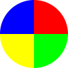
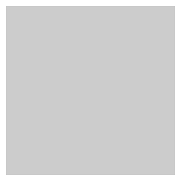
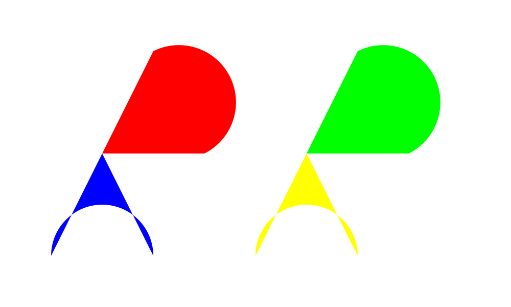
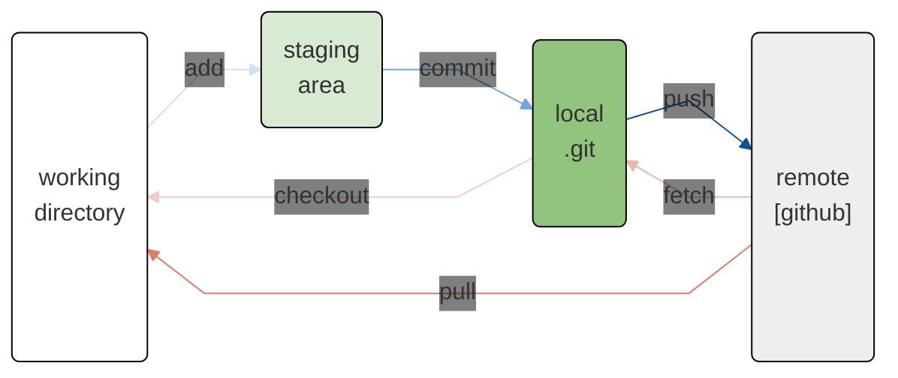
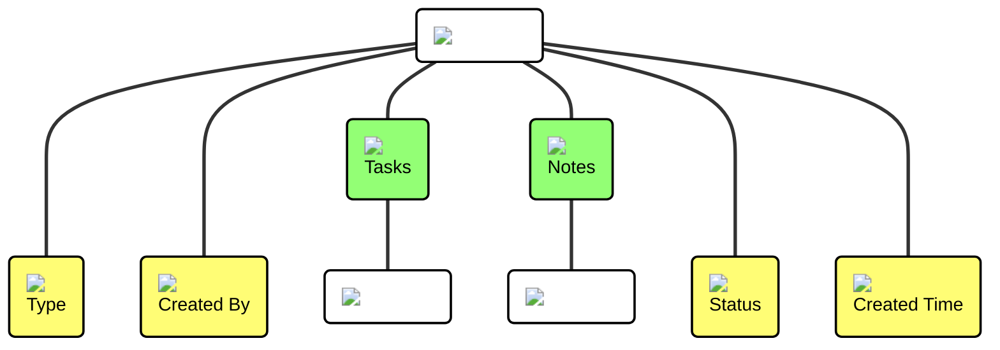
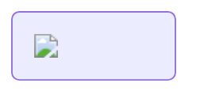

```mermaid
%%{init: {"flowchart": {"curve": "linear"}, "themeVariables": {"edgeLabelBackground": "transparent"}}}%%
flowchart LR
    wd(\n\n\nworking\ndirectory\n\n\n&nbsp)
    sa(staging\narea)
    lg(\nlocal\n.git\n&nbsp)
    rg("\n\n\nremote\n[github]\n\n\n&nbsp")
    
    lg -->|checkout| wd
    wd -->|add| sa
    sa -->|commit| lg
    lg -->|push| rg
    rg -->|fetch| lg
    rg --->|pull| wd
    
    %% Styles
    style wd fill:#fff,stroke:#000
    style sa fill:#d9ead3,stroke:#000
    style lg fill:#93c47d,stroke:#000
    style rg fill:#eee,stroke:#000
    linkStyle 0 stroke:#f4cccc,stroke-width:10px %% Arrow checkout
    linkStyle 1 stroke:#cfe2f3,stroke-width:10px %% Arrow add
    linkStyle 2 stroke:#6fa8dc,stroke-width:10px %% Arrow commit
    linkStyle 3 stroke:#0b5394,stroke-width:10px %% Arrow push
    linkStyle 4 stroke:#e6b8af,stroke-width:10px %% Arrow fetch
    linkStyle 5 stroke:#dd7e6b,stroke-width:10px %% Arrow pull
```

```mermaid

flowchart TB

	%% Colors %%
		linkStyle default stroke-width:3px
		classDef white fill:white,stroke:#000,stroke-width:2px,color:#000
		classDef yellow fill:#fffd75,stroke:#000,stroke-width:2px,color:#000
		classDef green fill:#93ff75,stroke:#000,stroke-width:2px,color:#000
	
	%% Databases %%
		DOCS("<img src='https://raw.githubusercontent.com/ccamacho/cluster/main/file-minus.svg'; width='40' />"):::white
		NOTES("<img src='https://super.so/icon/dark/book.svg'; width='40' />"):::white
		TASKS("<img src='https://super.so/icon/dark/check-square.svg'; width='40' />"):::white

	%% Documents Database %%

		DOCS ---- DOCTYPE("<img src='https://super.so/icon/dark/chevron-down.svg'; width='25' /> Type"):::yellow
		DOCS ---- DOCCREATEDBY("<img src='https://super.so/icon/dark/user.svg'; width='25' /> Created By"):::yellow

			%% Documents to Tasks %%
	
				DOCS --- DOCTASKS("<img src='https://super.so/icon/dark/arrow-up-right.svg'; width='25' /> Tasks"):::green
				DOCTASKS --- TASKS

			%% Documents to Notes %%

				DOCS --- DOCNOTE("<img src='https://super.so/icon/dark/arrow-up-right.svg'; width='25' /> Notes"):::green
				DOCNOTE --- NOTES

		DOCS ---- DOCSTATUS("<img src='https://super.so/icon/dark/chevron-down.svg'; width='25' /> Status"):::yellow
		DOCS ---- DOCCREATEDTIME("<img src='https://raw.githubusercontent.com/ccamacho/cluster/main/clock.svg'; width='25' /> Created Time"):::yellow

	%% Links %%
		click DOCS "https://redgregory.notion.site/c154907e263f48fe979a792588f3875a?v=2aabab98f87f479da4b9a66d86d61b50"
		click NOTES "https://redgregory.notion.site/89bb914e098041e2bee59b8f3aa09e73?v=9d216b2217c041d3a16c9460062847f2"
		click TASKS "https://redgregory.notion.site/82b9e09f12b747f4b92604598d38084b?v=3b53f53088f344d99bda1e2682e52f54"
	
```

```mermaid
graph TD
  DIR("<img src='https://raw.githubusercontent.com/ccamacho/cluster/main/ms-icon-310x310.png'; width='30' />")
```
